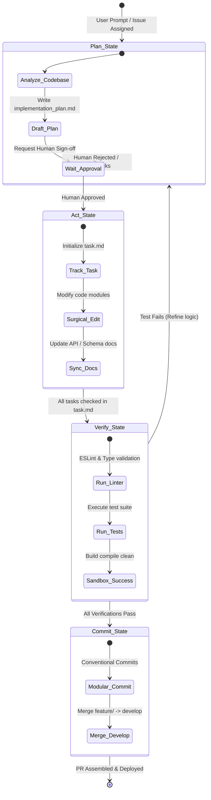

# ⚡ Agentic Bootstrap

> A production-grade CLI bootstrapper and repository boilerplate designed to scaffold, standardize, and accelerate human-agent collaborative development.

[](https://opensource.org/licenses/MIT)
[](#)
[](https://pages.github.com/)

**Agentic Bootstrap** elevates AI coding from a chaotic autocomplete experience to a highly structured, quality-controlled **Software Engineering Pipeline**. It introduces a strict, deterministic state machine that guides AI Agents (Cursor, Windsurf, Antigravity) through branching, committing, validating, and testing without manual oversight.

---

## 🌟 Key Features

1. **`node scripts/init.js` (Interactive Bootstrapper CLI)**
   An interactive Node.js terminal app that prompts developers about their project name, tech stack, environment needs (staging/production questionnaire), and preferred developer language, dynamically compiling customized `.cursorrules`, `task.md`, and environment scaffolds.
2. **Universal Rule Engine (`.cursorrules` & `PROJECT_RULES.md`)**
   A cross-editor rulebook that guides AI Agents through strict branching strategies, Conventional Commit syntax, and double-entry documentation requirements.
3. **Spec-Driven GitHub Templates**
   Preconfigured Issue and Pull Request templates formatted explicitly to prevent AI semantic drift and ensure deterministic code submissions.
4. **Docsify Single-Page Portal**
   A client-side documentation website configuration. Deploy to GitHub Pages instantly to get a responsive, searchable, bilingual documentation portal.

---

## 📐 System Architecture

### AI Agent State Machine Workflow
The core loop guarantees that the AI agent follows an engineered software cycle:



---

## 🚀 Quick Start

### 1. Fork/Clone the Repository
```bash
git clone https://github.com/your-username/agentic-bootstrap.git my-new-project
cd my-new-project
```

### 2. Run the Interactive CLI Bootstrapper
```bash
npm run init
```
This CLI will prompt you:
- Project Name.
- Technical Stack (React/NextJS, Vue, Backend Express, Vanilla).
- Environment Strategy (determines if your project warrants Staging based on user risk and third-party integrations).
- Preferred AI developer language.

It then generates a customized `.cursorrules`, `.env.example`, and a clean `task.md` checklist automatically!

### 3. Initialize Git Flow
```bash
git init
git checkout -b develop
```
Open the project in **Cursor** or **Windsurf**, and let the AI Agent inspect `.cursorrules` and start developing safely!

---

## 💼 AI Software Engineering: Behind the Scenes
*Why does this project serve as a top-tier portfolio for an **AI Software Engineer** role?*

Modern software organizations face significant challenges when integrating AI agents: **Context Window Bloat**, **Hallucinations**, and **Spaghetti Commits**. This boilerplate solves these challenges:
- **Token Efficiency**: The SOP forces AI agents to use "Surgical Edits" (local, modular changes) instead of rewriting entire files, reducing API overhead by up to 70%.
- **Context Synchronization**: The state machine enforces that documentation and plans are updated *before* writing code, keeping the agent aligned with the codebase state.
- **Git Quality Gate**: Conventional commit constraints and branch isolation guarantee a pristine Git tree, making agent code submissions clean and reviewable by human engineers.
