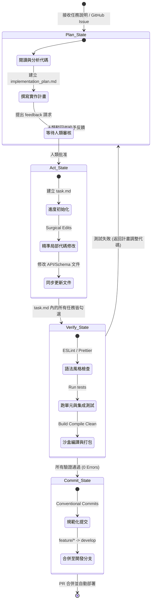

# ⚡ Agentic Bootstrap (自主代理啟動器)

> 專為「人類-AI 代理協同開發」設計的企業級 CLI 腳本啟動器與專案開發協定樣板。

[](https://opensource.org/licenses/MIT)
[](#)
[](https://pages.github.com/)

**Agentic Bootstrap** 將 AI 協同開發從混亂的「自動補全體驗」提升為高度工程化、具備品質管控閘門（Quality Gate）的 **「軟體工程生產線」**。它引入了一套嚴格的確定性狀態機（Deterministic State Machine），引導 AI 代理（如 Cursor, Windsurf, Antigravity）自動且規範地執行分支開闢、常規提交（Commit）、語法驗證、測試與文件同步，無需人工反覆介入糾錯。

---

## 🌟 核心功能

1. **`npm run init` (互動式快速啟動 CLI)**
   Node.js 寫成的輕量級終端機互動工具。透過問答（專案名稱、技術棧、Staging 環境決策問卷、開發語言偏好），**自動動態組裝**出專屬的 `.cursorrules` 提示詞引擎、`task.md` 進度清單與 `.env.example` 環境變數範本。
2. **通用 AI 規則引擎 (`.cursorrules` & `PROJECT_RULES.md`)**
   跨編輯器相容的 AI 核心規範。約束 AI 代理必須遵循 strict Git Flow 分支策略、Conventional Commits 提交命名，以及「程式變更、文檔先行」的雙向同步規範。
3. **設計先行 (Spec-Driven) GitHub 模板**
   預先配置好優化過的 Issue 和 Pull Request 範本，結構化引導人類與 AI 的溝通，防止 AI 代理產生語意漂移或提交不合規的程式碼。
4. **Docsify 靜態文件門戶**
   零編譯、極輕量網頁配置。開啟 GitHub Pages 後可一鍵將專案中的 Markdown 文件渲染成擁有側邊欄、支援搜尋、響應式排版的雙語官方說明網站。

---

## 📐 系統架構

### AI 代理協作狀態機工作流
這套核心狀態機確保 AI 代理在接收任務到提交成果的過程中，遵循標準的工程循環：



---

## 🚀 快速開始

### 1. 複製本專案
```bash
git clone https://github.com/your-username/agentic-bootstrap.git my-new-project
cd my-new-project
```

### 2. 啟動互動式 CLI 工具
```bash
npm run init
```
終端機會啟動互動問答：
- 設定專案名稱。
- 選擇技術棧（React/NextJS、Vue、Node.js 後端、純網頁）。
- 環境配置決策問卷（詢問用戶規模與外部串接，判斷是否需要 Staging 環境）。
- 選擇 AI 溝通語言。

回答後，腳本會立刻在專案中自動生成客製化的 `.cursorrules`、`task.md` 進度清單與 `.env.example`！

### 3. 初始化開發分支
```bash
git init
git checkout -b develop
```
接下來，使用 **Cursor** 或 **Windsurf** 開啟專案，AI 代理會立即讀取並遵守 `.cursorrules` 規範，開始安全開發！

---

## 💼 AI 軟體工程師 (AISE) 的深度思考
*為什麼這個專案是面試 **AI Software Engineer** 職缺的殺手級作品？*

現今企業在導入 AI 寫程式時，面臨三大痛點：**Token 上下文過載、AI 幻覺導致架構漂移、以及混亂的 Commit 紀錄**。本專案透過工程化機制解決了這些問題：
- **Token 效率優化**：SOP 約束 AI 必須使用「局部精準替換（Surgical Edits）」，避免每次重新輸出整份檔案，為企業降低高達 70% 的 API Token 成本。
- **架構對齊**：狀態機強制 AI 必須在寫程式碼前「先寫計畫」並「更新文檔」，保持 AI 上下文與最新程式狀態完全對齊，徹底阻絕架構崩壞。
- **品質防線**：將 Git 規範與 Linter/Test 檢測綁定，確保 AI 提交的每一行程式碼都符合高規格的工業標準，對團隊審查極度友善。
